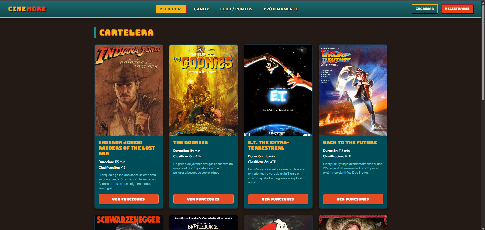
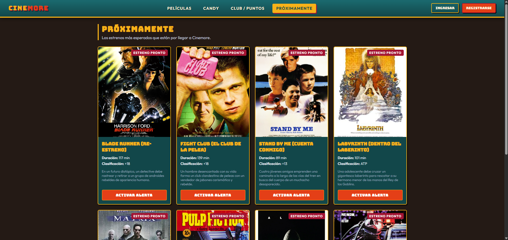

# CINEMORE — Sistema de Gestión y Venta de Entradas

Aplicación web desarrollada en **Angular** conectada en tiempo real a **Supabase (PostgreSQL)** para la reserva, gestión y venta de entradas de cine y productos de candy bar.

---

##  Estado del Proyecto: Sprint 1 

###  Capturas de la Aplicación

#### 1. Cartelera Principal (En Cartelera)
Vista de películas disponibles con formato y diseño de tarjeta retro, badges informativos (edad y duración) y sinopsis limitada:

#### 2. Sección Próximamente (Estrenos Futuros)
Filtrado reactivo desde la base de datos de películas donde `esta_en_cartelera = FALSE`, ordenadas por fecha de estreno:

---

##  Identidad Visual y Paleta de Colores

El diseño visual se construyó con estética retro-cinema de alto contraste para garantizar lectura y jerarquía visual clara:

| Elemento / Rol | Color Hex | Muestra | Descripción |
| :--- | :--- | :--- | :--- |
| **Fondo Principal** | `#0b1f28` |  | Base petróleo oscuro para inmersión visual. |
| **Bloque Informativo** | `#004d5a` |  | Verde azulado profundo para las tarjetas. |
| **Títulos y Acentos** | `#f7a827` |  | Amarillo dorado para tipografía retro y destacados. |
| **Botón de Acción (CTA)** | `#e64c23` |  | Naranja rojizo para llamadas a la acción (*Ver Funciones* / *Activar Alerta*). |
| **Textos Secundarios** | `#72cbd8` |  | Celeste cian para sinopsis y descripciones breves. |

---

##  Arquitectura Técnica y Decisiones

### Componentes Standalone (Angular)
Se optó por la arquitectura moderna de **Standalone Components** (`standalone: true`). Cada componente declara únicamente las dependencias que consume en su arreglo `imports: [...]` (por ejemplo `CommonModule`, `FormsModule`).

### Capa de Servicios y Desacoplamiento
La lógica de negocio y las consultas a la base de datos no se resuelven dentro del template HTML ni en los controladores de vista, sino en servicios inyectables (`@Injectable({ providedIn: 'root' })`):
* **`Peliculas` (`src/app/services/peliculas.ts`):** Centraliza las consultas `SELECT` a Supabase para separar películas en cartelera y próximos estrenos.
* **Separación de responsabilidades:** Los componentes solo reciben datos y manejan la interacción del usuario; la persistencia y reglas de datos quedan aisladas en el servicio.

### Control de Flujo Nativo
En los templates se utilizó la sintaxis de control de flujo de Angular (`@if`, `@else`, y `@for ... track`), optimizando el renderizado de listas frente a las directivas estructurales clásicas (`*ngFor`, `*ngIf`).

---

## 🗄️ Modelo de Base de Datos (Supabase / PostgreSQL)

El backend y almacenamiento de datos se gestiona directamente en **Supabase** mediante tablas relacionales normalizadas:

* **`usuarios`**: Extensión del perfil del cliente (rol, puntos, saldo a favor y datos personales).
* **`peliculas`**: Catálogo con atributos de duración, clasificación (+13, +18, ATP), formato y flags de cartelera/preventa.
* **`salas`**: Capacidad y nombres de las salas del complejo.
* **`butacas`**: Matriz de asientos tipificados (`ESTANDAR`, `ACCESIBLE`, `VIP`).
* **`funciones`**: Horarios de proyección por sala y película con precio base.
* **`comprasEntradas`** y **`entradas`**: Registro de operaciones y tickets emitidos con código QR.

### Seguridad con RLS (Row Level Security)
Las tablas tienen activado **Row Level Security**. Para este primer sprint se configuraron políticas de lectura pública (`FOR SELECT TO anon, authenticated`) para que los clientes puedan consultar la cartelera sin comprometer la integridad ni los permisos de escritura de la base.

---
